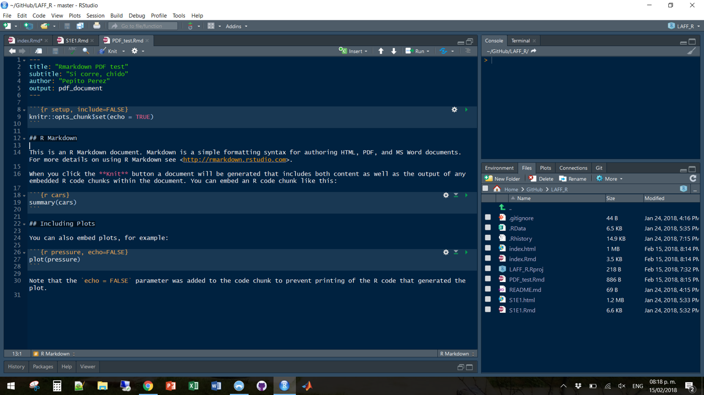
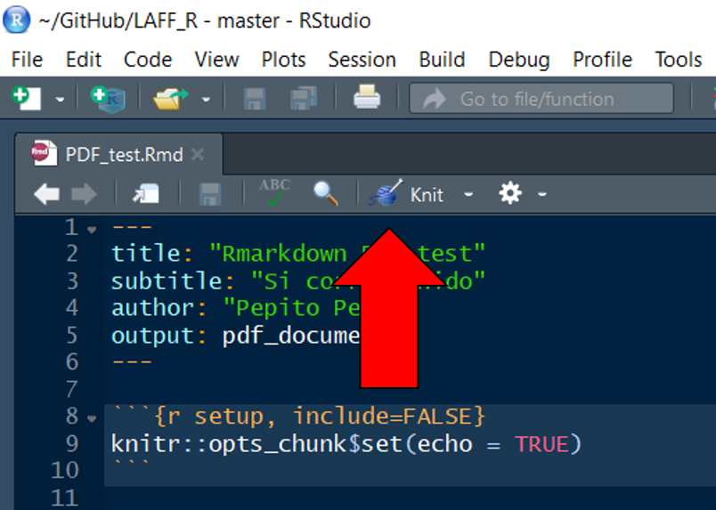

# **BEFORE TUESDAY!**

I hope that bold, all caps, exclamation is enough... but please, *please*, **please**, complete these 3 steps before Tuesday. You don't have to read all, you can just copy-paste the code, and do the things specified as

> Text of instructions

There are some things that might be a bit troublesome, but you only need to do them this one time

## Packages

For the stuff that we will cover, you will need to install (or make sure you have) some packages. You can copy and paste the following code, **as is**, to install them all:

```{r, eval = F}
install.packages(c("deSolve",
                   "tidyverse",
                   "rmarkdown",
                   "knitr",
                   "bookdown",
                   "magrittr",
                   "cowplot"))
```

If you are curious and can't wait until Tuesday, these is what they do:

- [`deSolve`](http://desolve.r-forge.r-project.org/): a bunch of numerical methods to solve Ordinary Differential equations (things like $\frac{dN}{dt} = rN$, but more complex)
- [`tidyverse`](https://www.tidyverse.org/): In and on itslef, `tidyverse` is not a package, but a collection of packages (`ggplot2`, `tibble`, `dplyr`, `tidyr`, `stringr`, `readr`, `purr`, `forcats`) that are the "Swiss army" of Data Science
- [`rmarkdown`](https://rmarkdown.rstudio.com/index.html): R Markdown Document Conversion (I know, not very desciptive, but we'll get to that)
- `knitr`: "dynamic" report generation in R (this and rmarkdown go hand in hand)
- `bookdown`: This is an "extension" of `rmarkdown`, with more customizable output formats

## Installation

Your default installation of some of the packages above will allow you to generate `html` and `word` documents. However, here we will try to produce `pdf` documents, which look more pro than a plain `word` document. (and no, having a `word` document and just saying Save As `pdf` is not the same, you'll see why...) In order to create `pdf` documents from `R`, we'll need to install `MikTeX`. I'll cover this on the class, but for now, please do the following:

> Go to [https://miktex.org/download](https://miktex.org/download) and select your operating system

## Test everything

After you have completed the three steps above, just download <button type="button">[this file](./PDF_test.Rmd)</button> the file. Right click on the button, select "Save link as..." ("Guardar enlace como..."), save it in your computer, and open it.

Your window should look something like this:




> Click the `knit` button, that looks like this:



R will do its thing, and if everything works, you'll get a nice(ish) PDF document... We'll make it look better!

Not working? Send me a message and we'll figure out a time to meet and see what's happening


## Files you'll need

Sometime over the weekend (I'll send a message) I'll put the slides and files we'll need here.

- [Rmakrdown slides](http://www.villasenor-derbez.com/intro2Rmd/CourseMaterials/intro2Rmd.html) (Yes, I am re-using them)


----

Other resources

- [R for Data Science FREE online book](http://r4ds.had.co.nz/)
